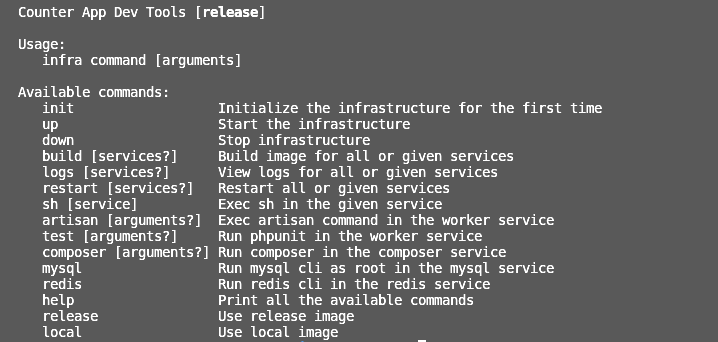

# APPLICATION FOR LOCAL TESTING
This is made to ease the process for testing locally. Please follow the instructions to setup your environment.

## INSTRUCTIONS:
1. Clone the repo to your machine.
2. Open the **.env** file to set the environment variables 
    **MAKE SURE TO SET THE USER AND GROUP VARIABLES**
    you can also set the ports for nginx and mailhog in case it conflicts with your machine otherwise leave it to default
3. Run `./infra help` to see the available commands
4. First command to run to initialize the environement is `./infra init` it will build and run the local environemnt
5. To switch between environments release/local you can run `source ./infra release` or `source ./infra local`
6. To enter mysql/redis cli run `./infra mysql` or `./infra redis`
7. To run artisan commands `./infra artisan <argument>`
8. To acces the shell of any container run `./infra sh <container-name>`
    container names: **worker, php-fpm, composer, mysql, redis, nginx, mailhog, schedular and composer**
9. You can see the logs of one, multiple or all containers run `./infra logs <container-name>`, `./infra logs <container-name> <container-name>`, or `./infra logs` with no arguements to show logs for all containers
10. To see current environment run the `./infra help` to see the current environment 
    